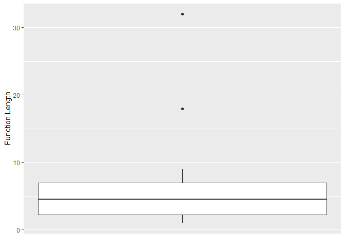

<!-- README.md is generated from README.Rmd. Please edit that file -->

# PackageR

<!-- badges: start -->

<!-- badges: end -->

The goal of PackageR is to to help users better understand their
package. When developing R packages, it’s easy to lose track of the
scale of the project. This package provides functions to give developers
a better insight into the number of functions, files, and their length.
From here, developers can work to identify overly-complex functions or
chokepoints and eventually write cleaner code.

## Installation

You can install the development version from
[GitHub](https://github.com/ARawles/PackageR) with:

``` r
# install.packages("devtools")
devtools::install_github("ARawles/packageR")
```

## Example

To get a high-level understanding of the functions and files in your
package, use the `plot_` functions. These functions will produce ggplot2
graphics showing you a bit more about your package:

``` r
plot_function_length()
```



To access the data in a more raw format, use the `list_functions()` and
`list_x_files()` functions:

``` r

list_functions()
#> [[1]]
#> [[1]]$name
#> [1] "file_length"
#> 
#> 
#> [[2]]
#> [[2]]$name
#> [1] "function_body"
#> 
#> 
#> [[3]]
#> [[3]]$name
#> [1] "function_info"
#> 
#> 
#> [[4]]
#> [[4]]$name
#> [1] "function_length"
#> 
#> 
#> [[5]]
#> [[5]]$name
#> [1] "function_list_to_tibble"
#> 
#> 
#> [[6]]
#> [[6]]$name
#> [1] "language_to_character"
#> 
#> 
#> [[7]]
#> [[7]]$name
#> [1] "library.dynam.unload"
#> 
#> 
#> [[8]]
#> [[8]]$name
#> [1] "list_functions"
#> 
#> 
#> [[9]]
#> [[9]]$name
#> [1] "list_r_files"
#> 
#> 
#> [[10]]
#> [[10]]$name
#> [1] "list_to_function_list"
#> 
#> 
#> [[11]]
#> [[11]]$name
#> [1] "plot_function_length"
#> 
#> 
#> [[12]]
#> [[12]]$name
#> [1] "system.file"
#> 
#> 
#> [[13]]
#> [[13]]$name
#> [1] "total_function_count"
#> 
#> 
#> [[14]]
#> [[14]]$name
#> [1] "total_function_length"

list_r_files()
#> [1] "man-roxygen/pkg.R" "R/files.R"         "R/functions.R"    
#> [4] "R/ne_utility.R"    "R/plot.R"          "R/total.R"        
#> [7] "R/utility.R"
```

By setting the `info` parameter to TRUE, you can retrieve more
information about the functions:

``` r

list_functions(info = TRUE)[[1]]
#> $name
#> [1] "file_length"
#> 
#> $body
#> {
#>     length(readLines(path))
#> }
#> 
#> $length
#> [1] 1
```
